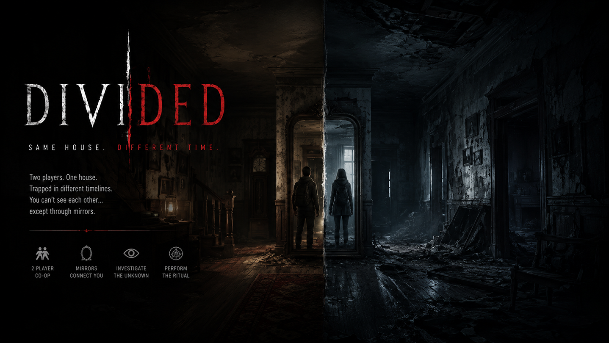

<div align="center">



# DIVIDED

### Same house. Different time.

A cooperative psychological horror game about two players trapped in the same house — but in different timelines.

[](https://www.unrealengine.com/)


</div>

---

## About the Game

**DIVIDED** is an atmospheric first-person cooperative horror game built with **Unreal Engine 5**. Two players explore the same house while existing in different versions of time — the **past** and the **future**.

The players cannot see each other directly. Their only connections are mirrors, shared objects, and changes that pass between timelines. To survive, they must exchange information, uncover evidence of paranormal activity, evade the entity, and complete the ritual together.

> One house. Two timelines. Your only chance of escape is to trust someone you can barely see.

## Key Features

- **Two-player co-op** — the experience is built around communication and cooperation between both players.
- **Two timelines** — characters, objects, collision, and visibility are synchronized independently across the past and future.
- **Mirrors as a connection** — mirrors reveal players and events hidden in the other timeline.
- **Paranormal investigation** — use a Ouija board, dosimeter, radio, clocks, and other interactive tools to uncover the house's secrets.
- **Rune ritual** — locate the correct symbols and place them into their matching pentagram slots.
- **A hostile entity** — AI behavior, chases, jump scares, and a hunt system maintain constant tension.
- **Physical interaction** — pick up, carry, drop, and drag objects while doors, drawers, and furniture respond to player actions.
- **Network synchronization** — server-authoritative gameplay and replicated state with support for Steam sessions.

## Gameplay Loop

1. Explore two different versions of the same house.
2. Communicate and compare what each player can see.
3. Use mirrors and investigation tools to discover clues.
4. Hide or run when the entity begins its hunt.
5. Find the correct runes and complete the ritual.

## Gameplay Gallery

<table>
  <tr>
    <td width="50%"></td>
    <td width="50%"></td>
  </tr>
  <tr>
    <td align="center"><sub>An encounter with the entity</sub></td>
    <td align="center"><sub>The hunt begins</sub></td>
  </tr>
  <tr>
    <td width="50%"></td>
    <td width="50%"></td>
  </tr>
  <tr>
    <td align="center"><sub>Players separated by time</sub></td>
    <td align="center"><sub>Mirrors reveal what is hidden</sub></td>
  </tr>
  <tr>
    <td width="50%"></td>
    <td width="50%"></td>
  </tr>
  <tr>
    <td align="center"><sub>Communicating with the unknown</sub></td>
    <td align="center"><sub>Paranormal manifestations</sub></td>
  </tr>
</table>

<div align="center">
  
  <br>
  <sub>Exploring the atmospheric house</sub>
</div>

## Technology

| System | Implementation |
| --- | --- |
| Engine | Unreal Engine 5.8 |
| Core gameplay | C++ and Blueprints |
| Input | Enhanced Input |
| AI | StateTree, Gameplay Tags, EQS |
| User interface | UMG / Slate |
| Networking | Unreal Replication, Online Subsystem, Steam Sessions |
| Visual systems | Lumen, post-process materials, Scene Capture / mirrors |

## Getting Started

### Requirements

- Unreal Engine **5.8**
- Visual Studio 2022 with the **Game development with C++** workload
- Windows 10/11
- Git LFS if the repository's large assets are stored through LFS

### Running Locally

```bash
git clone <repository-url>
cd UE_HorrorGame
```

1. Open `Hrono.uproject`.
2. Allow Unreal Engine to generate project files and compile the C++ modules if prompted.
3. Wait for shader compilation to finish.
4. Open `/Game/_Alex/DemoMap1` or the main menu at `/Game/HorrorEngine/Maps/MenuLevel`.
5. To test multiplayer, launch two game instances through **Play → Multiplayer Options**.

> This project is under active development. Gameplay mechanics, visual effects, and levels are subject to change.

## Repository Structure

```text
UE_HorrorGame/
├── Config/          # Engine, input, and game configuration
├── Content/         # Maps, Blueprints, materials, UI, and assets
├── Images_Git/      # Cover artwork and GitHub screenshots
├── Plugins/         # Project plugins
├── Source/Hrono/    # C++ character, item, AI, and networking code
└── Hrono.uproject   # Unreal Engine project file
```

## Development Status

DIVIDED is currently an **actively developed gameplay prototype**. The core co-op, timeline, mirror, object interaction, chase, and ritual systems are in place and continue to evolve.

## License

The repository's code is distributed under the terms described in [LICENSE](LICENSE). Third-party assets and plugins may be covered by their own licenses.

---

<div align="center">

**Can you trust someone you can only see through a mirror?**

</div>
